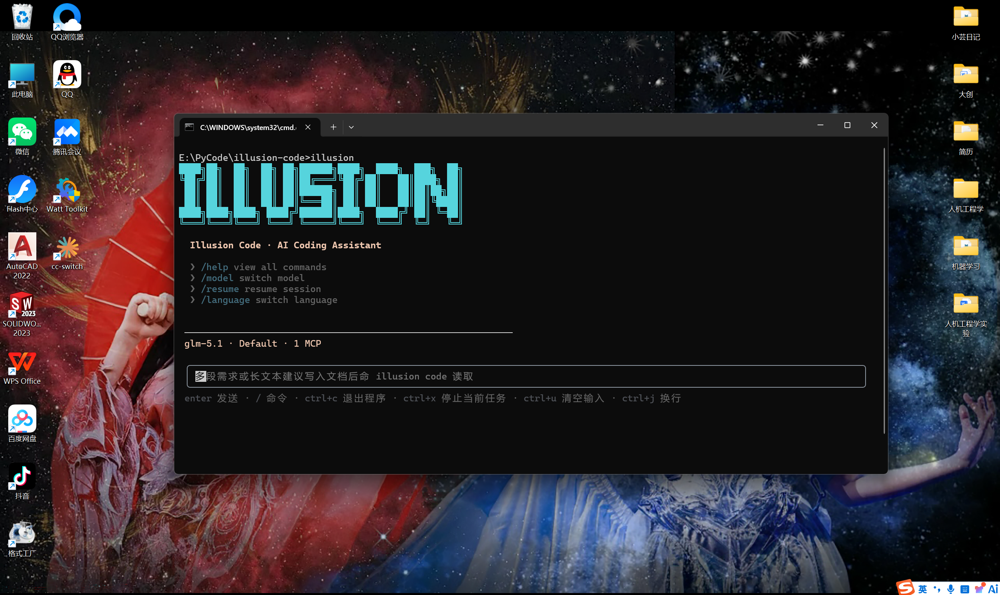
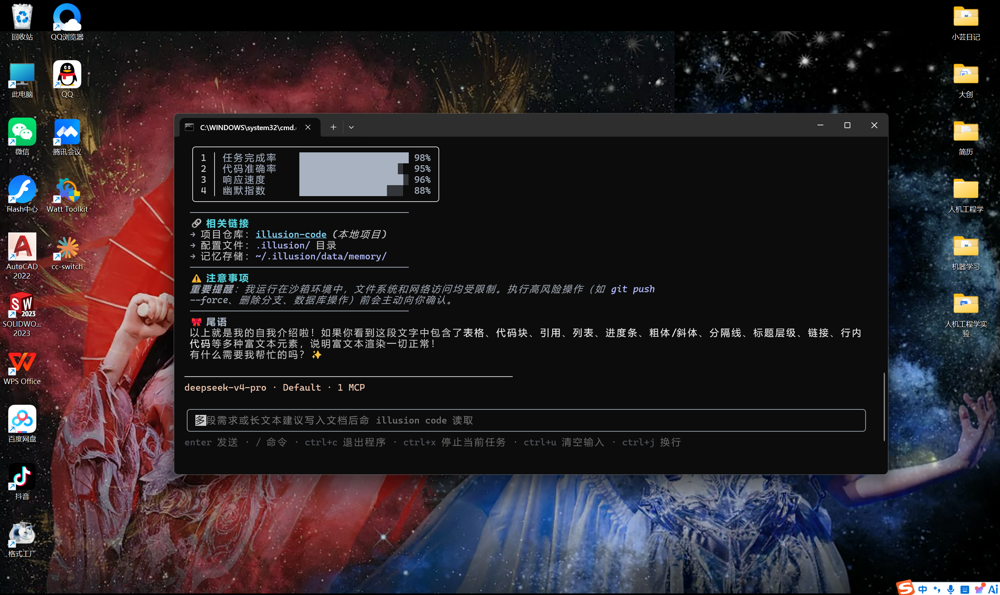

# IllusionCode

<div align="center">

**AI 驱动的命令行编程助手**

*集百家之所长，融会贯通的智能编程工具*

中文 | [English](README.md)

</div>

---

## 📖 项目简介

IllusionCode 是一个开源的 AI 驱动命令行编程助手，集成了众多优秀项目的精华并加以创新。它继承了 Claude Code 的完整提示词体系和工具架构，在 Python 架构设计上借鉴了 OpenHarness 的理念，采用与 OpenClaw 相同的 Cron 任务调度架构，从 kimi-cli 移植了核心基础设施模块（异步队列、stderr fd 级重定向、跨平台 SIGINT 处理），参考 hermes-agent 实现了渠道连接/渲染模式（飞书 WS、微信 iLink、QQ Bot 网关），并通过 cc-switch 反代方案实现了灵活的代理路由。在此基础上，IllusionCode 针对 Windows 系统进行了深度优化，提供了完整的中英双语界面支持，实现了比同类项目更全面的 Markdown 终端渲染能力，并提供了浏览器端的 Web UI 界面。

### 核心特性

- 🌐 **Web UI 界面** - 通过 `illusion web` 启动浏览器聊天界面，与终端界面相互独立、同等可用
- 🪟 **Windows 系统深度优化** - 自动查找 Git、PowerShell 支持
- 🖥️ **终端渲染零闪烁** - 基于 Ink Static 组件的稳定渲染
- 🌍 **中英双语支持** - 所有 CLI 输出根据 `ui_language` 设置自动切换中英文
- 📝 **全面 Markdown 渲染** - 直角边框表格、圆角卡片代码块、多色富文本
- 🤖 **多 AI 提供商支持** - Anthropic Claude、OpenAI、GitHub Copilot、OpenAI Codex 及任意 OpenAI 兼容端点
- 🛠️ **丰富的工具集** - 42 内置工具（29 基础 + 13 渠道）+ MCP 动态工具扩展
- ⌨️ **49 个斜杠命令** - 覆盖会话管理、配置、项目操作、任务调度等
- 🧠 **多智能体协作** - 7 种内置专业 Agent，支持任务编排
- 🔌 **灵活扩展系统** - 插件、钩子、技能、MCP 服务器
- 🔐 **完善权限控制** - 三种模式 + 细粒度规则 + Always Allow 一键放行
- 🎯 **推理强度控制** - 支持 low/medium/high/xhigh/max 五种推理强度级别

### 界面展示

<div align="center">
  <p>欢迎界面 & 富文本渲染</p>
  
  
</div>

<div align="center">
  <p>演示视频</p>
  <a href="https://b23.tv/3mWe9It">
    
  </a>
  <p><a href="https://b23.tv/3mWe9It">📺 B站观看演示视频</a></p>
</div>

---

## 🚀 快速开始

### 环境要求

- Python >= 3.10
- 支持 Windows、macOS、Linux
- Node.js 18+（仅源码安装需要，`pip install illusion-code` 无需 Node.js）

### 安装

```bash
# 推荐方式：从 PyPI 安装（无需 Node.js）
pip install illusion-code

# 备选方式：从源码安装（需要 Node.js 18+）
git clone https://github.com/YunTaiHua/illusion-code.git
cd illusion-code
pip install .
```

### 基本使用

```bash
# 首次使用：配置认证
illusion auth login

# 启动交互式会话（推荐）
illusion

# 启动 Web UI 浏览器界面
illusion web

# 非交互式打印模式
illusion -p "帮我分析这个项目的结构"
```

### Print 模式说明

`-p` / `--print` 以非交互方式执行单次请求并立即退出：

```bash
# 只读分析（安全，默认权限模式）
illusion -p "帮我分析这个项目的结构"

# 允许写入文件 / 执行命令，无需交互式审批
illusion --permission-mode full_auto -p "修复失败的测试"

# 进程以退出码 2 结束后，继续回答待处理的问题 / 权限 / 计划
illusion -c -p "Y"

# 指定模型和 effort 等级用于 print 模式
illusion -m env_1.model_2 -e high -p "重构此模块"
```

重要细节：

- 提示词值必须放在 **最后一个参数**，因为 typer 会贪婪解析 `-p`。
- 默认权限模式下，变更类工具会以退出码 **2** 退出并保留待审批项；使用 `illusion -c -p "Y"`、`"F"` 或 `"N"` 继续回答。
- 退出码：`0` 成功，`1` 错误，`2` 等待跨轮次输入。

### 界面说明

终端（`illusion`）与 Web UI（`illusion web`）是两个相互独立、同等重要的界面。它们共享同一个后端运行时、设置和会话存储，按你的工作流选择即可。

---

## 📚 详细文档

| 主题 | English | 中文 |
|------|---------|------|
| 项目简介 | [docs/en/introduction.md](docs/en/introduction.md) | [docs/zh-CN/introduction.md](docs/zh-CN/introduction.md) |
| 快速开始 | [docs/en/getting-started.md](docs/en/getting-started.md) | [docs/zh-CN/getting-started.md](docs/zh-CN/getting-started.md) |
| 命令系统 | [docs/en/commands.md](docs/en/commands.md) | [docs/zh-CN/commands.md](docs/zh-CN/commands.md) |
| 设置与凭据 | [docs/en/settings.md](docs/en/settings.md) | [docs/zh-CN/settings.md](docs/zh-CN/settings.md) |
| 项目文件与记忆 | [docs/en/project-files.md](docs/en/project-files.md) | [docs/zh-CN/project-files.md](docs/zh-CN/project-files.md) |
| 扩展系统 (MCP, 插件, 技能, 钩子) | [docs/en/extensions.md](docs/en/extensions.md) | [docs/zh-CN/extensions.md](docs/zh-CN/extensions.md) |
| 项目架构 | [docs/en/architecture.md](docs/en/architecture.md) | [docs/zh-CN/architecture.md](docs/zh-CN/architecture.md) |
| 消息渠道 | [docs/en/channels.md](docs/en/channels.md) | [docs/zh-CN/channels.md](docs/zh-CN/channels.md) |

---

## 📄 许可证

本项目采用 [MIT](LICENSE) 许可证开源。

---

## 🤝 贡献

欢迎提交 Issue 和 Pull Request！

---

</div>
